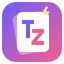

<p align="center"></p>

# ThantFlash

Thant Zin ရဲ့ **Flash Card + Reminder** web app — install လုပ်စရာမလို၊ browser မှာ တန်းသုံးလို့ရပါတယ်။

## လုပ်ဆောင်ချက်များ

- 📚 **Flash Card** — ကတ်လှန်ပြီး လေ့လာ၊ *မသိ / ခက် / သိ / လွယ်* နဲ့ အမှတ်ပေး။
  Spaced repetition (SM-2 ပုံစံ) နဲ့ ပြန်လေ့လာရမယ့်နေ့ကို အလိုအလျောက် တွက်ပေးတယ်။
- 🗂️ **Deck များ** — ကတ်တွေကို Deck အလိုက် ခွဲ၊ ပြင်၊ ဖျက်၊ ရှာ။ JSON export / import။
- ⏰ **Reminder** — တစ်ကြိမ် / နေ့တိုင်း / အပတ်တိုင်း သတိပေးချက်၊ browser notification + အသံ။
  📅 ခလုတ်နဲ့ Google Calendar ထဲ ထည့်လို့ရ (app ပိတ်ထားရင်လည်း သတိပေးစေချင်ရင်)။
- 📱 PWA — ဖုန်း Home screen ပေါ် ထည့်ပြီး offline သုံးလို့ရ။
- 🌙 Dark mode အလိုအလျောက်။

Data အားလုံးကို ကိုယ့် browser ရဲ့ `localStorage` ထဲမှာပဲ သိမ်းပါတယ်။

## Keyboard

| Key | လုပ်ဆောင်ချက် |
| --- | --- |
| `Space` / `Enter` | ကတ်လှန် |
| `1` `2` `3` `4` | မသိ / ခက် / သိ / လွယ် |

## Run

```bash
python3 -m http.server 8000
# http://localhost:8000
```

## GitHub Pages နဲ့ တင်ရန်

Repo **Settings → Pages → Branch: `main` / root** ရွေးပြီး Save လုပ်ပါ။
`https://<username>.github.io/ThantFlash/` မှာ သုံးလို့ရပါမယ်။
