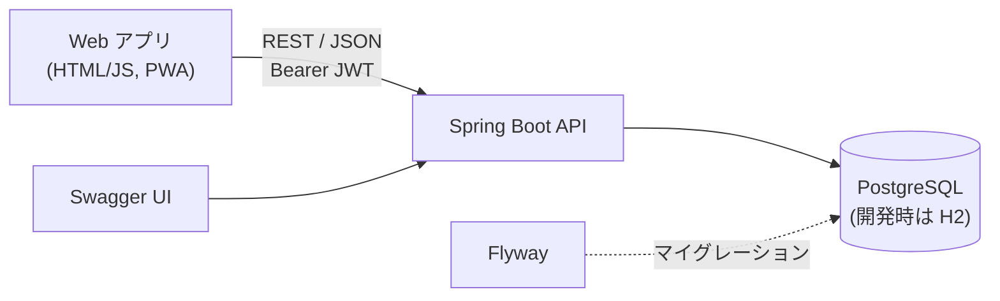
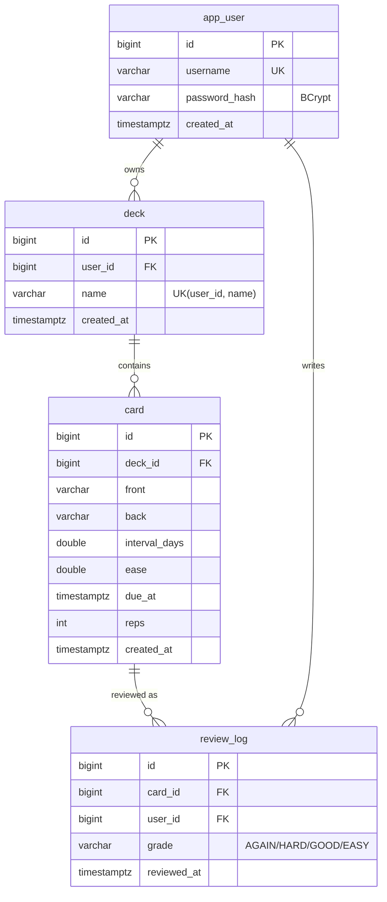
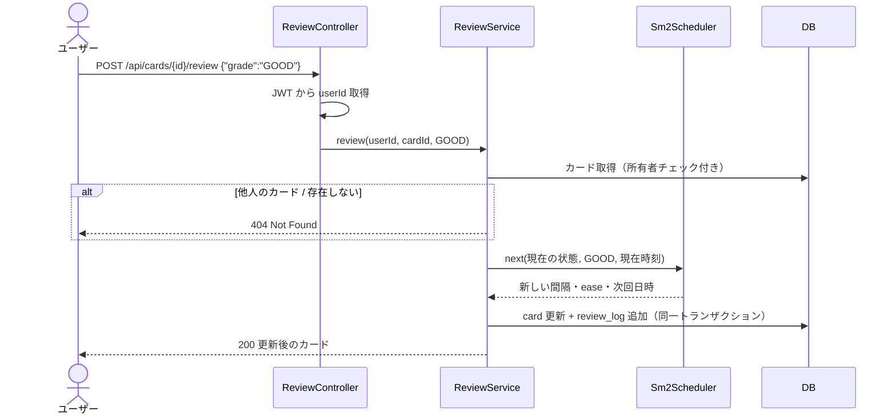

# ThantFlash 設計書

## 1. システム概要

語学学習用フラッシュカードアプリ「ThantFlash」のバックエンド API。
忘却曲線に基づく間隔反復アルゴリズム（SM-2 簡易版）で、次に復習すべき日時を自動計算する。

## 2. レイヤー構成

| レイヤー | 責務 | 例 |
| --- | --- | --- |
| Controller | HTTP の入出力、入力チェック（Bean Validation） | `DeckController` |
| Service | 業務ロジック、トランザクション境界、所有者チェック | `DeckService` |
| Repository | DB アクセス（Spring Data JPA / JPQL） | `DeckRepository` |
| Entity | テーブルとの対応 | `Deck` |
| DTO | API の入出力（Java record） | `DeckDtos.DeckResponse` |

## 3. ER 図

外部キーはすべて `ON DELETE CASCADE`（デッキ削除 → カード・履歴も削除）。
スキーマは `src/main/resources/db/migration/V1__init.sql` で管理。

## 4. API 一覧

| # | メソッド | パス | 概要 | 認証 |
| --- | --- | --- | --- | --- |
| 1 | POST | `/api/auth/register` | ユーザー登録、JWT 発行 | 不要 |
| 2 | POST | `/api/auth/login` | ログイン、JWT 発行 | 不要 |
| 3 | GET | `/api/decks` | デッキ一覧（カード数・復習待ち数付き） | 要 |
| 4 | POST | `/api/decks` | デッキ作成 | 要 |
| 5 | PUT | `/api/decks/{id}` | デッキ名変更 | 要 |
| 6 | DELETE | `/api/decks/{id}` | デッキ削除 | 要 |
| 7 | GET | `/api/decks/{id}/cards?q=` | カード一覧・検索 | 要 |
| 8 | POST | `/api/decks/{id}/cards` | カード作成 | 要 |
| 9 | PUT | `/api/cards/{id}` | カード更新（デッキ移動可） | 要 |
| 10 | DELETE | `/api/cards/{id}` | カード削除 | 要 |
| 11 | POST | `/api/import/tsv?deck=` | Anki 形式 TSV 一括登録 | 要 |
| 12 | GET | `/api/study/due` | 復習対象カード取得 | 要 |
| 13 | POST | `/api/cards/{id}/review` | 回答評価 → 次回日時更新 | 要 |
| 14 | GET | `/api/stats?zone=` | 学習統計（連続日数・正答率など） | 要 |

### エラーレスポンス（RFC 9457）

| ステータス | 発生条件 |
| --- | --- |
| 400 | 入力チェックエラー（`errors` にフィールド別メッセージ） |
| 401 | トークンなし・期限切れ、ログイン失敗 |
| 404 | リソースが存在しない、**または他ユーザーの所有物** |
| 409 | ユーザー名・デッキ名の重複 |

## 5. 間隔反復アルゴリズム（SM-2 簡易版）

| 評価 | 次の間隔 | ease 係数 |
| --- | --- | --- |
| AGAIN（わからない） | 0 日（1 分後に再出題） | −0.2 |
| HARD（難しい） | 間隔 × 1.2（最低 1 日） | −0.15 |
| GOOD（わかる） | 間隔 × ease（初回 1 日） | 変化なし |
| EASY（簡単） | 間隔 × ease × 1.3（初回 3 日） | +0.15 |

ease の下限は 1.3。間隔は小数第 1 位で丸める。実装: `review/Sm2Scheduler.java`

## 6. シーケンス図（復習）

## 7. セキュリティ

- パスワードは BCrypt でハッシュ化して保存
- JWT（HS256）、有効期限 7 日、`sub` にユーザー ID
- セッションを持たない（Stateless）ため CSRF 対策は不要、CORS は許可オリジンのみ
- 本番では `THANTFLASH_JWT_SECRET` 環境変数で秘密鍵を上書きする

## 8. テスト方針

| 種類 | 対象 | ツール |
| --- | --- | --- |
| 単体テスト | SM-2 計算、TSV 解析、連続日数計算 | JUnit 5 + AssertJ |
| 結合テスト | 登録 → デッキ → カード → 復習 → 統計、ユーザー間のデータ分離、エラー応答 | `@SpringBootTest` + MockMvc + H2 |

GitHub Actions で push のたびに `mvn verify` を実行。
